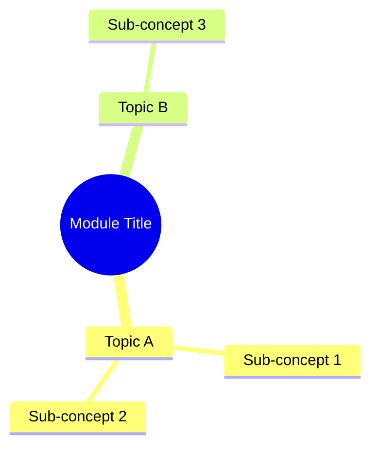

# Module N: [Title]

Est. study time: [X]h
Language: [en/zh/yue]
Description: [Optional short description for cover generation]

<!--
  Diagrams: place .mmd source files in diagrams/ dir.
  After enrich, run: learn.sh render-diagrams <topic> <module>
  Rendered PNGs stored in diagrams/ alongside lesson.
  -->

## Knowledge Map



---

## Learning Objectives (maps to course CILOs)
- [Objective 1 — serves CILO #N]
- [Objective 2 — serves CILO #N]

---

## Real-World Example

[Start with concrete scenario from daily work. Pose a problem learner has likely encountered. What went wrong? Why did it happen?]

> **Think**: Why did the [person/team] encounter this problem? What would you have done differently?
>
> *Answer: [brief explanation]*

---

## Core Content

### [Section 1: Concept Name]

[Introduce concept using the real-world example above. Explain what it is and why it exists.]

> ```mermaid
> [Mermaid diagram showing relationship, workflow, or state transition]
> ```

> **Think**: [Question that challenges learner on concept just introduced]
>
> *Answer: [Brief explanation so learner can self-check]*

> **Cloze**: "[Sentence or two with {blank} for key term to fill in.]"
>
> *Answer: [the blank term]*

Formula: `[relevant formula]`

**Example:**
```
[Concrete example tied to the real-world scenario]
```

> **Predict**: [Causal question about what happens next given the concept just explained?]
>
> *Answer: [Explanation of outcome and why]*

### [Section 2: Concept Name]

[Extended explanation, edge cases, common pitfalls]

> **Think**: [Question probing edge case or common mistake]
>
> *Answer: [Explanation resolving the question]*

> **Cloze**: "[Sentence with {blank} for key term]"
>
> *Answer: [the blank term]*

> **Spot the Mistake**: [Present a plausible wrong solution or reasoning. Include what someone might mistakenly think.]
>
> What's wrong?
>
> *Answer: [Explain the error and correct framing]*

### [Section 3: Application in Learner's Domain]

[How this plays out in learner's industry or daily work. Show a worked example step by step.]

> **Think**: [Question connecting concept to practical scenario]
>
> *Answer: [How this plays out in real work]*

> **Predict**: [What would happen if you changed a parameter or made an error in this scenario?]
>
> *Answer: [Explanation of the changed outcome]*

---

### Why This Matters

[Explain why this module's concepts matter in real-world practice. What problem do they solve? Who uses them daily? What happens if you get this wrong?]

---

## Key Takeaways
- [Takeaway 1]
- [Takeaway 2]
- [Takeaway 3]
- [Takeaway 4]
- [Takeaway 5]

---

## Common Misconception

[One specific misunderstanding beginners hold about this topic. State misconception → explain why it's wrong → give correct framing.]

---

## Spot the Mistake

[Another error-spotting exercise — can be a code snippet, calculation, or reasoning chain with an embedded error.]

What's wrong?

*Answer: [Explanation of the error]*

---

## Feynman Explain
(Teach [core concept] to a child. Use simplest words. No jargon. Give concrete example from daily work. Do NOT move on until you can explain it clearly without vague language.)

*When ready, say explanation aloud or write it down. Then run `learn.sh explain <subject>` — AI will probe your explanation for gaps.*

---

## Reframe
(Pause. Judge [core concept]: does this make sense? When would this logic break? What's the counterargument? Write your evaluation.)

---

## Drill
Take the quiz. MCQs test different angles — recall, application, scenario.

Run: `learn.sh quiz <subject> <module-id>`
